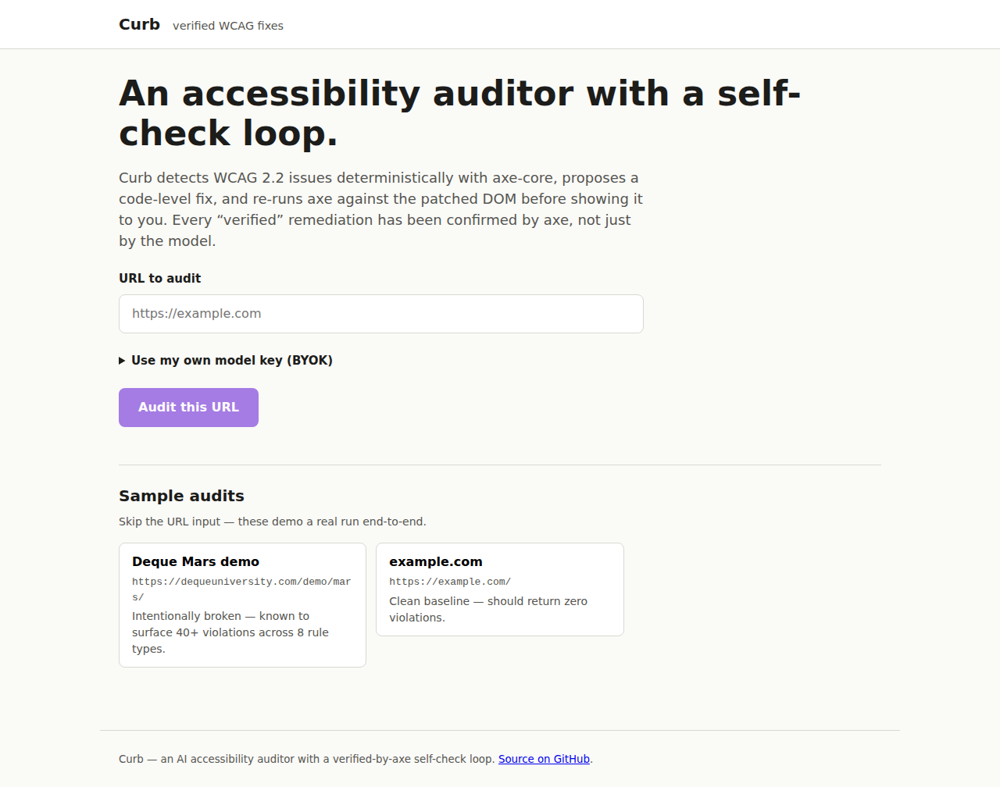
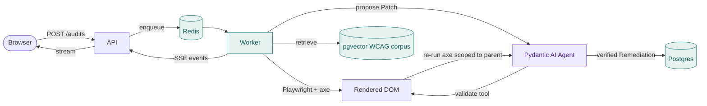

# Curb &nbsp; [](https://github.com/hitenpatel/curb/actions/workflows/ci.yml) &nbsp; [](https://a11y.hiten.dev) &nbsp; [](evals/model-comparison.md)

> **An AI accessibility auditor that doesn't just detect WCAG issues &mdash; it proposes verified
> code fixes, scored by an eval harness whose primary metric is deterministic (re-run axe-core on
> the patched DOM). Runs on free and local models.**

`https://a11y.hiten.dev` &nbsp;·&nbsp; [Architecture](docs/ARCHITECTURE.md) &nbsp;·&nbsp; [Model comparison](evals/model-comparison.md) &nbsp;·&nbsp; [Source](https://github.com/hitenpatel/curb)

---

## The pitch in thirty seconds

LLMs propose plausible accessibility fixes that are often wrong. Curb makes the output trustworthy
and measurable:

1. **Detection is deterministic.** [axe-core](https://github.com/dequelabs/axe-core) runs against
   the rendered DOM via Playwright. The model never decides whether a violation exists.
2. **Remediation is grounded.** A WCAG 2.2 + ARIA APG corpus is embedded locally (MiniLM / BGE,
   no torch), retrieved per violation via pgvector HNSW + a criterion-id boost.
3. **Every fix is verified by axe, not by the model.** The Pydantic AI agent has one tool,
   `validate`, which applies the proposed patch to the live page and re-runs axe scoped to the
   parent region. The worker **overrides** the agent's `verified` claim with what `validate`
   actually returned. A hallucinated `verified=true` is silently corrected to false.
4. **The eval harness gates deploys.** Golden dataset of WCAG fixtures; primary metric is the
   re-run-axe pass rate over conclusive cases. CI runs it on every push; a regression blocks the
   deploy job.
5. **Free by design.** Local embeddings, free-tier generation (Gemini / Groq / GitHub Models /
   Ollama) selected in a single provider-agnostic gateway, per-request BYOK overrides that never
   touch disk.
6. **Curb eats its own dog food.** A CI test runs axe-core against Curb's own home page and fails
   the deploy on any WCAG A/AA violation.

## What "verified" means (and doesn't)

**Verified** means exactly one thing: an axe re-scan of the patched DOM no longer reports the
violation and no new violations appeared. It is a mechanical regression check &mdash; not WCAG
conformance, and not a substitute for human review. Automated tools detect roughly a third to a
half of WCAG failures; axe can confirm an `alt` attribute exists but not that its text is
meaningful. The UI labels those cases per-fix ("needs a human"), and the live site documents the
full contract at [a11y.hiten.dev/methodology](https://a11y.hiten.dev/methodology).

## Live demo

`https://a11y.hiten.dev` &mdash; try one of the sample audits (precomputed real runs &mdash; they
open instantly), or paste a URL of your own. Anonymous live audits are rate-limited per IP; add
your own model key in the BYOK panel for a higher limit without using the server's free-tier
quota.




## How it works



Full architecture, data model, and the verified-only contract: see
[`docs/ARCHITECTURE.md`](docs/ARCHITECTURE.md).

## Model comparison

Same harness, same golden dataset, two free-tier models. The eval marks rate-limit failures
inconclusive (they're API flakes, not regressions) and only counts conclusive runs toward the pass
rate. Latest run:

| Model | Pass rate | Verified | Conclusive | Inconclusive | Avg conf |
| --- | --- | --- | --- | --- | --- |
| `google-gla:gemini-2.5-flash` | **0%** | 0 | 0 | 6 | 0.00 |
| `google-gla:gemini-2.5-flash-lite` | **100%** | 4 | 4 | 2 | 0.95 |

_(2.5-flash's row is rate-limit-bound on the day this was run; same key, separate quotas per model.
The harness measures honest model quality &mdash; flakiness in a free tier doesn't fail it.)_

Per-case detail in [`evals/model-comparison.md`](evals/model-comparison.md). Regenerate with:

```sh
MODEL_API_KEY=… uv run python -m evals.compare \
    google-gla:gemini-2.5-flash \
    google-gla:gemini-2.5-flash-lite
```

## Repository layout

```
apps/web/           SvelteKit 2 + Svelte 5 runes, TypeScript
services/api/       FastAPI: audits + SSE
services/worker/    Playwright + axe, retrieval, the agent, scoring
packages/shared/    Pydantic models + Redis bus conventions
corpus/             WCAG 2.2 + ARIA APG sources + ingest.py
evals/              Golden dataset + scorer + model comparison
infra/              Docker compose + Dockerfiles
docs/               Architecture (Mermaid)
```

## Local development

```sh
just dev            # web + api + worker via docker compose
just test           # pytest + svelte-check (fast subset)
just corpus         # rebuild the WCAG embeddings corpus
just eval           # full eval harness against the golden suite
just eval-smoke     # the one-case smoke run used by the pre-push hook
just lint           # ruff
just typecheck      # mypy --strict
```

## Deployment

Docker / Traefik on a self-hosted ARM box. DNS A record for `a11y.hiten.dev` points at the box;
Traefik terminates TLS via Cloudflare DNS-01 ACME. Push to `main` runs the verify job (lint,
mypy strict, pytest, svelte-check + build, eval gate), which gates the deploy job
(SSH + `docker compose up -d --build`).

Secrets: `DB_PASSWORD` and `MODEL_API_KEY` live in `~/curb/.env` on the box (gitignored, chmod
600). BYOK keys are per-request only and live in the worker process for the duration of one audit.

## Eval harness

- **Primary metric, deterministic and free.** Apply the generated patch to the fixture, re-run
  axe-core scoped to the parent region, check the violation is resolved with no new violations.
  Ground truth.
- **Secondary metric (DeepEval G-Eval, deferred).** Idiomaticity, intent-preservation, explanation
  correctness. Slot exists in `EvalResult`; integration lands as a follow-up.
- **CI gate.** `uv run pytest evals` runs on every push. Inconclusive (rate-limit) runs don't fail;
  conclusive bad runs do. Summary lives at `evals/last-run.md`, also uploaded as a CI artifact.
- **Pre-push smoke.** A 1-case subset runs in `.githooks/pre-push` so the round-trip is fast.

## Tech stack

- **Backend**: Python 3.12, FastAPI, asyncpg, redis-py, Playwright Python (Chromium pinned to
  v1.60.0), Pydantic AI, fastembed (ONNX, no torch), pgvector.
- **Frontend**: SvelteKit 2, Svelte 5 runes, TypeScript strict, Node adapter, design tokens +
  scoped CSS Modules.
- **Data**: Postgres 17 + pgvector, Redis 7 (job queue + SSE pub/sub).
- **Infra**: Docker Compose, Traefik v3 (Cloudflare DNS-01 ACME), GitHub Actions.
- **Tooling**: `uv` workspaces (api / worker / shared), pnpm workspace, `just` task runner, ruff,
  mypy strict.

## The story (for interviews)

> LLMs propose plausible accessibility fixes that are often wrong. I built the
> trustworthiness in three layers. Detection is deterministic &mdash; axe-core decides whether a
> violation exists, not the model. Remediation is grounded in retrieved WCAG / ARIA guidance. And
> every fix is verified by axe through a `validate` tool the agent must call: the tool applies the
> proposed patch to the live page in Playwright and re-runs axe-core scoped to the parent region.
> The worker overrides the agent's `verified` claim with what `validate` actually returned, so
> hallucinated success is silently corrected. The whole thing is scored by an eval harness whose
> primary metric is deterministic (re-run-axe pass rate over a golden dataset), gating the deploy
> in CI. Free-tier models cap fix quality, which the harness measures rather than hides.

## License

Apache 2.0 for project code. axe-core is MPL-2.0 (vendored under `services/worker/curb_worker/vendor/`).
