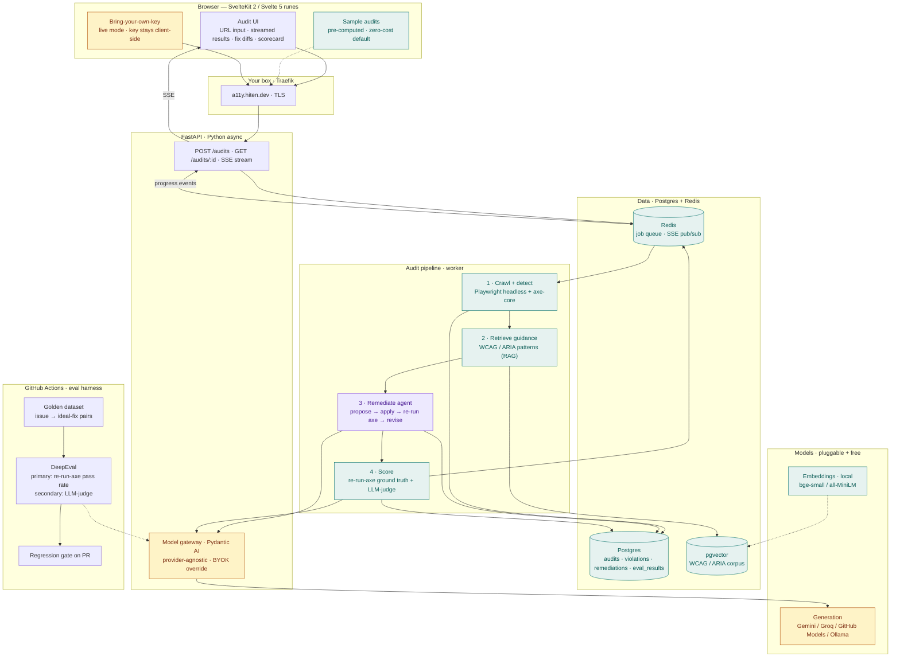

# Curb — architecture

This document is the canonical tour of the system. Keep it current with the code; the brief lists
it as a showcase artefact in its own right. The diagram below is also available as a standalone
source file at [`architecture.mermaid`](architecture.mermaid).

## Diagram



**Colour key.** Green is free, local, or deterministic. Amber is the pluggable model layer — the
only thing that could ever cost money, and even that runs free or BYOK. Purple is the agentic
core: the remediation agent and its `validate` self-check loop, which is what makes the output
trustworthy.

## Services

| Service | Tech | Role |
| --- | --- | --- |
| `web` | SvelteKit 2 + Svelte 5 runes, TypeScript, adapter-node | URL input, streamed results, fix diffs, scorecard, BYOK entry, pre-computed sample audits. Node, port 3000. |
| `api` | FastAPI (async), Pydantic AI gateway | Enqueues audits, streams progress over SSE, serves results and samples. Holds the provider-agnostic model gateway. Port 8000, exposed at `https://a11y.hiten.dev/api/…`. |
| `worker` | Playwright (Python) + Chromium + axe-core, pgvector retrieval, the remediation agent | Consumes Redis jobs. Detection is deterministic; the model is scoped to the one job it actually adds value to. |
| `db` | Postgres 17 + pgvector | Audits, violations, remediations, eval results; HNSW-indexed WCAG corpus. |
| `redis` | Redis 7 | Job queue and SSE pub/sub. |

All services share an internal Docker network. `api` and `web` join the external `traefik`
network so they can be routed at `a11y.hiten.dev` with the project's ACME resolver (`le`).

## Request lifecycle

1. A URL is submitted (or a sample loaded) and routed through Traefik to FastAPI. The API
   enqueues an audit job in Redis and opens an SSE channel to the client.
2. The worker loads the page in headless Playwright, injects axe-core, runs it against the
   rendered DOM, and emits structured violations (rule id, WCAG criterion, severity, offending
   node selector and markup). Deterministic and free.
3. For each violation it retrieves relevant WCAG 2.2 and ARIA APG guidance from pgvector using
   local embeddings (MiniLM / BGE), grounding the fix and cutting hallucination.
4. The remediation agent proposes a fix as a unified diff with an explanation tied to the
   criterion, then self-verifies via its `validate` tool (next section).
5. Scoring runs; results stream into the UI grouped by criterion and severity, each with a diff
   and a scorecard.
6. Everything persists to Postgres for history and trends.

## The remediation agent

The agent does not emit a fix and hope. It is given the violation, the offending markup, and the
retrieved guidance, and it has a **`validate` tool** it must use: the tool applies the candidate
patch to the DOM in the Playwright page and re-runs axe-core scoped to the **parent region** (the
target element's outerHTML is being replaced, so the original selector won't survive). It returns
whether the target violation is resolved and whether any new violation appeared against a baseline
captured before the patch.

The agent loops _propose → apply → re-check → revise_, bounded, and only marks a remediation
`verified` once axe confirms it.

### The verified-only contract

Three layers of defence:

1. **System prompt.** The agent is instructed never to return `verified=true` until the validate
   tool has returned `resolved=true` with an empty `new_violations` list.
2. **Tool typing.** The agent's output is a `Remediation` model whose `verified: bool` is the
   only mutable surface for the claim. Output validation rejects malformed responses.
3. **Worker override.** After the run, `propose_and_verify` (`curb_worker.agent`) overrides
   `verified` with what the **last `validate` call actually returned**. If `validate` was never
   called, `verified` is forced to false. A hallucinated `verified=true` is silently corrected.

The two `FunctionModel`-driven tests in `services/worker/tests/test_agent.py` prove this is
load-bearing: a liar agent that emits `verified=true` without calling validate gets its claim
flipped to false; an honest agent that says `verified=false` after a successful validate gets
promoted to true.

Root-level violations (`<html lang>`, etc.) are a special case &mdash; you can't replace
`document.documentElement`'s outerHTML because its parent is the Document node. The validate tool
falls back to copying attributes from the proposed markup onto the live root element.

## Model gateway

A thin resolver builds the Pydantic AI model from config (default: a free tier such as Gemini
2.5-flash via Google AI Studio) or from a per-request provider + key in BYOK mode. BYOK keys live
only in the worker process for the duration of one audit; they're carried on the Redis job payload,
popped, used, then forgotten. Never persisted, never logged.

The gateway is the **only** place the model is chosen. Cost and provider are config, not
architecture. Today the gateway supports `google-gla`, `groq`, and `openai`; adding a provider is a
new `if`-arm in `build_model()`.

## Eval harness

- `evals/runner.py` is the core scorer: for one `GoldenCase` (fixture HTML + expected
  `axe_rule_id`), load → detect (assert expected rule fires) → retrieve guidance → run agent →
  return `EvalResult`. Primary metric is `verified`, propagated from the same worker flag the live
  audit writes after `validate` confirms.
- `evals/golden/` holds 6 cases covering the rule ids axe-core hits most in the wild &mdash;
  image-alt (1.1.1), button-name (4.1.2), link-name (2.4.4), html-has-lang (3.1.1), label (1.3.1),
  frame-title (4.1.2). The label fixture went through two iterations because axe accepts
  `placeholder` as a label-equivalent fallback; the case has to be a bare input.
- `evals/compare.py` is the model-comparison harness &mdash; runs the suite per `provider:model`
  string and emits a Markdown table.
- Inconclusive runs (rate-limit, transient API error) are excluded from the pass-rate denominator.
  A free-tier flake shouldn't block deploy; a conclusive bad run should.

## Frontend

SvelteKit 2 + Svelte 5 runes, TypeScript strict, Node adapter on port 3000. Routes:

- `/` &mdash; URL input form, optional BYOK `<details>` panel (provider + key, sent on POST,
  never persisted), sample-audit cards.
- `/audit/[id]` &mdash; server-side load fetches the `AuditDetail`; on mount the client opens an
  `EventSource` against `/api/audits/:id/events` and merges status / violation / remediation /
  complete events into the page state.

Same-origin: Traefik routes `/api/*` to FastAPI and the rest to the SvelteKit Node adapter, so the
client uses relative paths.

A11y: skip link, semantic landmarks, focus-visible outlines, `aria-live="polite"` announcer for
SSE updates, `prefers-color-scheme` + `prefers-reduced-motion` honoured. A CI test
(`apps/web/tests/test_app_a11y.py`) boots the built Node adapter, runs axe-core against the home
page, and fails the deploy on any WCAG A/AA violation. Curb meets the bar it audits for.

## Eval harness

- **Golden dataset** (`evals/golden/*.json`): fixture, expected violations, ideal fix. Curated
  from real WCAG remediation work — the moat.
- **Primary metric, deterministic and free.** Apply the generated patch to the fixture, re-run
  axe, check the violation is resolved with no new violations. Ground truth.
- **Secondary metric, LLM-judge on a free tier, batched.** DeepEval G-Eval for idiomaticity,
  intent-preservation, and explanation correctness.
- **CI gate.** `deepeval test run evals/golden` runs on push to `main`; the deploy job depends on
  it, so a regression blocks deployment even though there is no PR to block.
- **Pre-push smoke.** `evals/smoke/` is a fast subset run by `.githooks/pre-push` for local feedback.

## Data model

The canonical schema is `services/api/curb_api/db/schema.sql` (idempotent &mdash; applied at
startup; we'll graduate to Alembic when the schema actually grows). Shape:

```sql
audits(id, url, status, created_at, updated_at, error, violation_count, model_used, summary jsonb)
violations(id, audit_id, rule_id, wcag_criterion, description, help, help_url,
           severity, selector, markup, failure_summary, created_at)
remediations(id, violation_id, audit_id, wcag_criterion, severity, explanation,
             patch jsonb, confidence, verified bool, new_violations text[],
             model_used, created_at)
wcag_chunks(id, source, criterion, title, body, embedding vector(384), created_at)
```

`wcag_chunks` carries an HNSW index on `embedding` (cosine ops) plus a btree on `criterion` for the
hybrid retrieval: vector neighbours unioned with all chunks for the matching criterion id, scored
with a small additive criterion-match boost, deduped, top-k.

## Retrieval pattern

The first cut was vector-ANN + a re-rank boost. That missed chunks whose vector match was weak but
whose criterion was known-correct (axe gave us the SC id deterministically &mdash; that's signal).
The fix is to **union** the vector-ANN candidates with all chunks for the matching criterion id,
then score-and-merge. The boost-only flavour fails on the deliberately-vague test query in
`services/worker/tests/test_retrieval.py::test_criterion_boost_is_applied`; explicit union passes.
